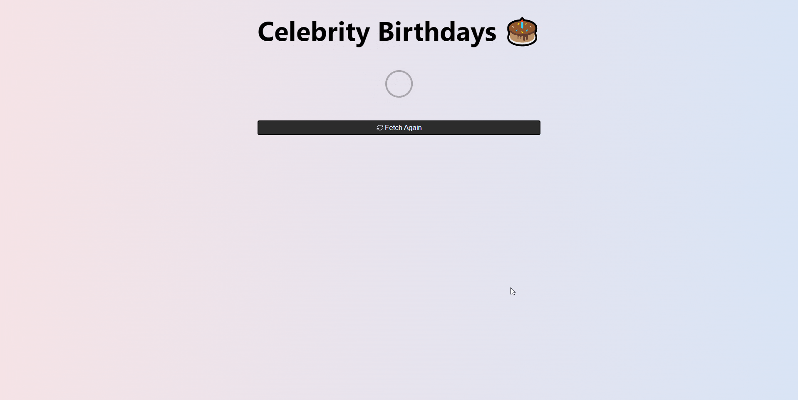

# Celebrity Birthdays 🎂

A simple list app for celebrity birthdays.

Fetched and created celebrities are stored in localStorage.

This project was developed using **React, Redux, TypeScript** and **[Celebrity API](https://api-ninjas.com/api/celebrity)**.



## Installation Prerequisites

> Make sure you have **Node.js** installed on your system.

If you haven't cloned this repository to your local machine yet, clone it first with fetch options (HTTPS, SSH, GitHub CLI).

If you have already cloned, you can skip to **Installation & Running** steps.

**Clone this repository**

Open your terminal and clone this repository to your local with the HTTPS option.

```bash
$ git clone https://github.com/ilhanozkan/celebrity-birthday.git
```

## Installation & Running

1 - Install dependencies

Navigate to the frontend folder in terminal.

```bash
cd game-store/backend
```

Run installation command in terminal.

```bash
npm i
```

2 - Create environment variables file

Create a file named `.env` under the root folder.

Paste your [Celebrity API](https://api-ninjas.com/api/celebrity) API key into this file.

Example **.env** file:

```bash
REACT_APP_API_KEY=YOUR_API_KEY_IS_HERE
```

3 - Start the project

Start the project in development.

```bash
npm start
```

## License

MIT License

Copyright (c) 2022 Ilhan Ozkan

Permission is hereby granted, free of charge, to any person obtaining a copy
of this software and associated documentation files (the "Software"), to deal
in the Software without restriction, including without limitation the rights
to use, copy, modify, merge, publish, distribute, sublicense, and/or sell
copies of the Software, and to permit persons to whom the Software is
furnished to do so, subject to the following conditions:

The above copyright notice and this permission notice shall be included in all
copies or substantial portions of the Software.

THE SOFTWARE IS PROVIDED "AS IS", WITHOUT WARRANTY OF ANY KIND, EXPRESS OR
IMPLIED, INCLUDING BUT NOT LIMITED TO THE WARRANTIES OF MERCHANTABILITY,
FITNESS FOR A PARTICULAR PURPOSE AND NONINFRINGEMENT. IN NO EVENT SHALL THE
AUTHORS OR COPYRIGHT HOLDERS BE LIABLE FOR ANY CLAIM, DAMAGES OR OTHER
LIABILITY, WHETHER IN AN ACTION OF CONTRACT, TORT OR OTHERWISE, ARISING FROM,
OUT OF OR IN CONNECTION WITH THE SOFTWARE OR THE USE OR OTHER DEALINGS IN THE
SOFTWARE.
